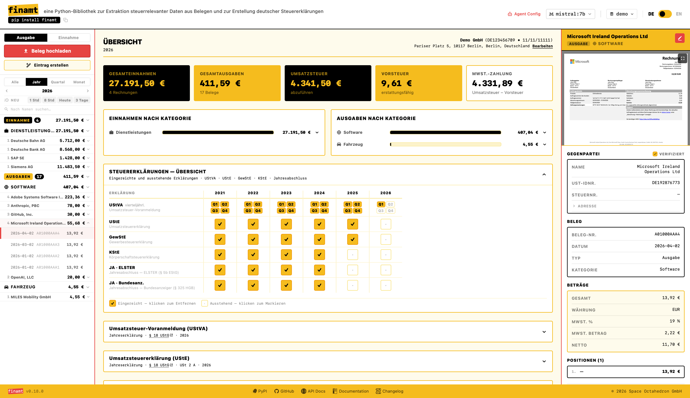
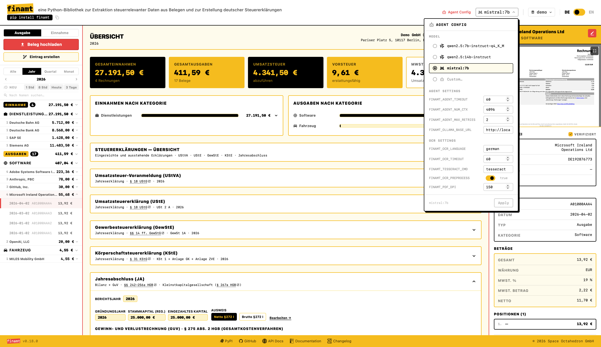
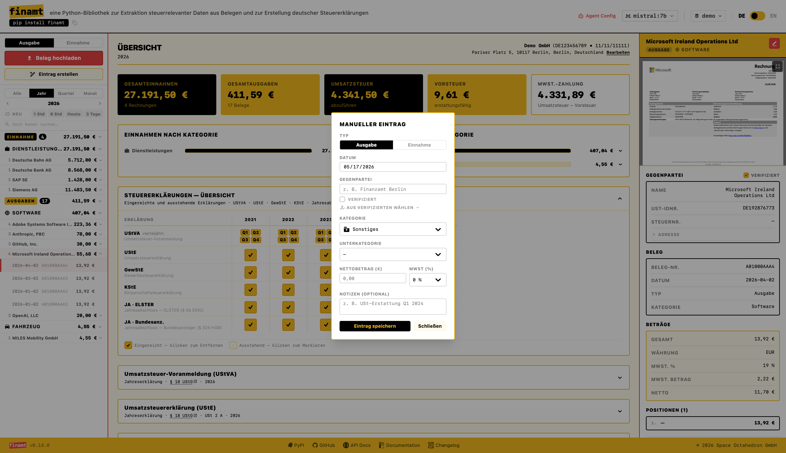
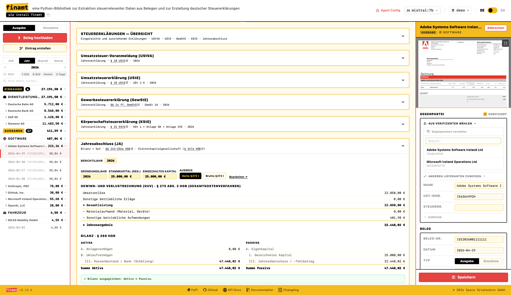

# finamt

 

 

**finamt-ui** is a React-based frontend for the [finamt](https://github.com/spaceoctahedron/finamt) project, built as static assets for integration with the [finamt PyPI package UI](https://pypi.org/project/finamt/).
>
>  [Main backend repo](https://github.com/spaceoctahedron/finamt)
>
>  [PyPI package](https://pypi.org/project/finamt/)

## UI Overview

**Returns Overview**  
This financial app helps you keep all your returns in view, without overloading you with details.

---
**Agent Configuration**  
Privacy-first app — lets you choose a local model that helps with extracting financial details from receipts.

---

**Manual Entry**  
Add all other custom transactions using the manual entry option.

---

**Annual Balance Sheet**  
All key returns including the Annual Balance Sheet are automatically generated. All data never leaves a local database on your computer — submit directly to Finanzamt via ELSTER and Bundesanzeiger via Publikations-Plattform.

